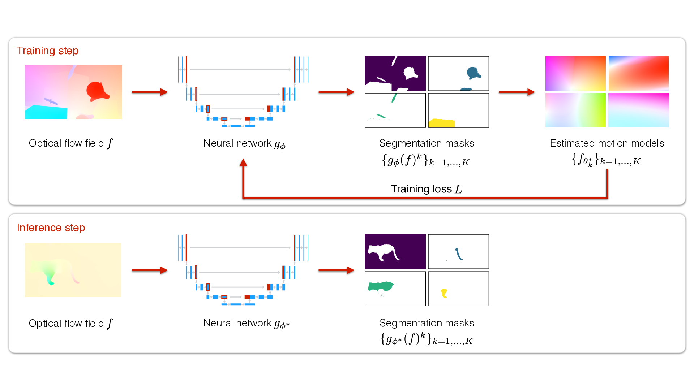
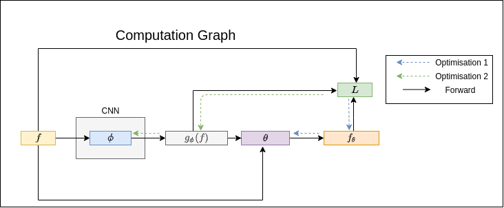

# EM-driven unsupervised learning for efficient motion segmentation

[[PAMI](https://ieeexplore.ieee.org/document/9855882)] : E. Meunier, A. Badoual and P. Bouthemy, "EM-Driven Unsupervised Learning for Efficient Motion Segmentation," in *IEEE Transactions on Pattern Analysis and Machine Intelligence*, 2022, doi: 10.1109/TPAMI.2022.3198480.

[[Arxiv](https://arxiv.org/pdf/2201.02074.pdf)] : Etienne Meunier, Anaïs Badoual, and Patrick Bouthemy. "EM-driven unsupervised learning for efficient motion segmentation." *arXiv preprint arXiv:2201.02074* (2022).



## CSV Flow Module

In order to use this code with your data you need to create your own "DataSplit" csv files. Those files contains the path to the files used for training / evaluation. Each row represent a sample and columns the file for each modality.  You can find more information in this [description](csvflowdatamodule/README.md).

The Datasplit used for training is given as an example as `Exp6_Split`.

##### Rows :

- `Flow` : path to an optical flow field (.flo). Can be computed for your dataset using [[RAFT](https://github.com/princeton-vl/RAFT)] we use `raft-sintel.pth`.

- `GtMask`: path to the binary mask for evaluation only.

- `Image` : RGB Frame for figures only.

##### Splits :

Data is split into `train`, `val` and `test`. Train and val are used during in `model_train.py`, `test` can be used in `model_eval.py`.

Those split should follow the name pattern : `MySuperSplit_train.csv`, `MySuperSplit_val.csv` and `MySuperSplit_test.csv`.

## Train Model

You can train the model on your own data once your created your DataSplit.

```bash
python3 model_train.py --path_save_model /path/model_dir
					   --base_dir /path/dataset/
                       --data_file Datasplit/MySuperSplit
```

- `path_save_model` : path where the model and training progression are saved
- `base_dir` : base path for the files in the data split
- `data_file`: path of the DataSplits to use

If `path_save_model` is enabled, the checkpoint (.ckpt) of the best model - defined as the one with the lowest validation loss - is saved along with a file "results.csv" that save score and jaccard for each frame during the training.

**Additional Options :**

- <u>Input Flow</u> :
  - `--image_size int int`  : choose the input  / output size for the frames. Publication : 128x224.
	- `-L int`  : Number of output masks. Publication : 2 for evaluation.
  - `--flow_augmentation str` : use a flow augmentation adding a global motion to the input optical flow as detailled in the paper. You can use `globalmotion`for affine motion and `globalmotionfullquad` for quadratic ones along with a strenght controlling the balance between the global motion and the original one form `light`, `medium` and `strong`.  Publication : `globalmotionfullquadlight`.
  - `--inputs list(str)` : columns in DataSplit to use as input of the network. Options are `Flow`, `Image` and `FlowRGB`. Inputs will be concatenated if there is several ones.  Publication : `Flow`
- <u>Model Structure</u> :
  - `--param_model str` : Parametric model to use in the loss. `Quadratic` or `Affine`
  - `--v_distance str` : Distance metric to use : `squared`, `l1`or `l2`
- <u>Training Parameters :</u>
  - All Pytorch Lightning Parameters detailled here : [[link]](https://pytorch-lightning.readthedocs.io/en/latest/common/lightning_module.html)
  - Notably `--gpus int` to enable training with GPU
  - Logger : everything is setup to use a logger. We used [[Wandb]](https://docs.wandb.ai/). See [[PL documentation]](https://pytorch-lightning.readthedocs.io/en/latest/) to setup your own.

## Run Model

```python
# LOAD MODEL : First you need to download the weights on our page
from Models.CoherenceNets.MethodeB import MethodeB
ckpt = '2-Masks/checkpoint/model.ckpt'# Path of the model
model = MethodeB.load_from_checkpoint(ckpt, strict=False).eval()

# LOAD FLOW FIELD :
from csvflowdatamodule.CsvDataset import FilesLoaders
flow_path='images/00000.flo' # Example flow provided in the repo
flow = FilesLoaders().load_file(path=flow_path, type='Flow', img_size=model.hparams['img_size'])

# COMPUTE PREDICTION
with torch.no_grad() :
    r = model.prediction({'Flow' :flow[None]})
plt.imshow(r['Pred'][0,1] > 0.5)
```

A notebook "[Segment a Flow](Segment-a-Flow.ipynb)" with those steps is also provided.

## Evaluate Model

### Evaluation Script

You can download the checkpoint of the model evaluated in the paper here (ckpt file) : [[CHECKPOINT](https://gitlab.inria.fr/serpico/em-driven-segmentation-data/-/tree/main/2-Masks%20(%201tdcjfqp%20)/checkpoint)]

You can evaluate the model using the script :

```bash
python3 model_eval.py --ckpt /path/model/checkpoint.ckpt
					  --save_dir /path/dir/
					  --base_dir /path/dataset/
            --data_file Datasplit/MySuperSplit
						--binary_method_gen exceptbiggest
					  --steps val test
					  --draw_figs
					  --save_npy
					  --save_mask
```

- `ckpt` : path checkpoint (.ckpt) file with model weights
- `save_dir` : path where to save the results files. In addition to figures is saved a `results_{step}.csv` file with the score for each frame.
- `base_dir` : base path for the files in the data split
- `data_file`: path of the DataSplits to use
- `binary_method_gen` : {exceptbiggest, fair} method used to select segments and generate binary masks.
- `draw_figs`: enable figure drawing
- `save_npy`: enable saving npy file with probabilities
- `save_mask`: save binary mask for evaluation

*Warning* : The evaluation with this script is performed on frames of the size defined for the training of the model ( default : 128x224 ). Thus to perform valid evaluation on benchmark you need to resize the prediction to the size of the original Ground Truth mask. If you want to perform proper evaluation from your `.npy` files you can use the code in [evaluationmodule](evaluationmodule).

## Use our Loss in your project :star:

An additional interesting point of this code is to use our loss in your own projects. As long as you have an optical flow corresponding to your image you can train the network to produce motion-coherent segments ( even if the flow is not given as input to the network).

```python
coherence_loss(pred, flow, param_model='Quadratic', v_distance='l1') :
    """Compute coherence loss for a segment based on the given flow.

    Parameters
    ----------
    pred torch.tensor (b, L, I, J) : Mask proba predictions
    flow torch.tensor (b, 2, I, J) : Optical flow map
    param_model str : Parametric model used for regression ( Affine, Quadratic). Default : Quadratic
    v_distance str : name of the vector distance to use for computation (l1, l2, squared). Default : l1
    Returns
    -------
    coherence_losses (b): coherence loss for each sample of the batch
    """
```

<u>Example of usage :</u>

```python
pred = MySuperModel(image) # You design your network that takes image as input and return segmentation pred

coherence_loss = coherence_loss(pred, flow) # Using optical flow and prediction compute coherence loss

coherence_loss.mean().backward() # Coherence loss is differentiable !

MySuperModel.grad # Gradients with respect to the coherence loss to train your network.
```

This way you can use `coherence_loss` to regularise your network even in collaboration with an other loss.



## Computed Results and Model Weights :

Download results and evaluations for the datasets here : [[RESULTS](https://gitlab.inria.fr/serpico/em-driven-segmentation-data/-/tree/main/2-Masks%20(%201tdcjfqp%20)/Eval-230222)]

All frames used for training and validation are listed in `DataSplit/Exp6_Split_{train/val}.csv`


## Environment :

*Use Python 3.7.7 with the following requirements* :

```
pytorch_lightning==1.2.8
pandas==0.24.1
flowiz
wandb==0.10.26
ipdb==0.13.5
torch==1.8.1
torchvision==0.9.1
seaborn
```
