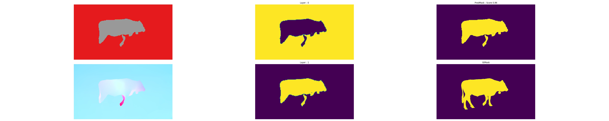

# Evaluation Module 

Module to evaluate the segmentations on classical VOS datasets : DAVIS, FBMS, SegTrackV2, MoCa. 



This modules allows to go from the `proba.npy` mask with the probabilty of each pixel belonging to a mask to binary segmentation and to compute score. It resizes the probability maps if necessary to fit the GT mask and also save the binary segmentation. 

## Evaluate Predictions 

Once you produced the predictions `.npy` using the script `model_eval.py` you can launch the evaluation. 

For this you need a DataSplit file with your dataset and the base directory of your prediction. For each frame in the DataSplit file, the corresponding prediction will be retrieved using the base directory and the name of the file and the score will be computed. 

Along with the score in a csv file the scripts outputs binary mask used to compute the scores and a figure every 10 frame to check the different steps of the scoring process and a .json file with all evaluation details for traceability. 

```bash
python3 Evaluation.py --scoring_method db_eval_iou 
					  --binary_method exceptbiggest 
					  --model_id MyModelV8 
					  --model_base_dir /path/to/dir/
					  --data_file ../DataSplit/MySuperSplit_val.csv
					  --data_base_dir /path/to/data
```

- `scoring_method` : Method used to score prediction. `db_eval_iou` for classic IoU and `bbox_jacc` for the bounding box IoU for MoCa
- `binary_method` : Method to go from a multi-mask segmentation to a binary one.
  -  `exceptbiggest` to choose all masks as foreground except the biggest one ( this is the one we used in the main part of the paper) 
  - `fair` to choose all masks that overlap sufficiently with the Ground Truth mask ( we used this one only for table 3). Note that this second loss **should not** be used for VOS benchmarks as it is using the GT. 

Results are saved in `{model_base_dir}/{model_id}/evaluation_{datetime}/`. 

**NB** : For a thorough DAVIS evaluation you need to use the binary mask generated by this script and the [[official evaluation script](https://github.com/fperazzi/davis)].

Reported results with official evaluations can be download here : [EVALUATIONS](https://gitlab.inria.fr/serpico/em-driven-segmentation-data/-/tree/main/2-Masks%20(%201tdcjfqp%20)/Eval-230222)

